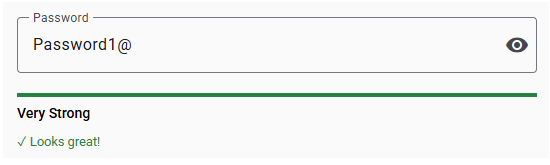
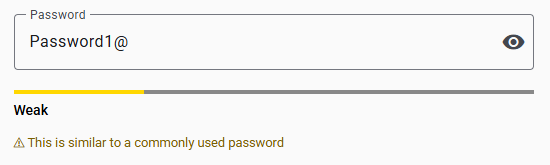

# @ngx-zen/mat-password-meter

[](https://www.npmjs.com/package/@ngx-zen/mat-password-meter)
[](https://github.com/ngx-zen/mat-password-meter/actions/workflows/ci.yml)
[](https://codecov.io/gh/ngx-zen/mat-password-meter)
[](LICENSE)

Three Angular Material password strength components: rule-based, entropy-based, and a combined full meter, all with a signals-based API.

**[Live Demo →](https://ngx-zen.github.io/mat-password-meter/)**

| Rule-based | Entropy-based |
|:---:|:---:|
|  |  |

## Components

| Component | Entry point | What it does |
|-----------|-------------|--------------|
| `PasswordStrengthComponent` | `@ngx-zen/mat-password-meter/strength` | Full meter — policy rules **and** entropy, both must be satisfied |
| `PasswordRulesComponent` | `@ngx-zen/mat-password-meter/rules` | Regex policy checks (length, case, numbers, symbols) |
| `PasswordAnalysisComponent` | `@ngx-zen/mat-password-meter/analysis` | [zxcvbn](https://github.com/dropbox/zxcvbn) entropy scoring, lazy-loaded |

## Which component should I use?

- **`PasswordStrengthComponent`** — the default, recommended component. Combines rule enforcement and zxcvbn analysis: the bar only reaches 100 when both are simultaneously satisfied.
- **`PasswordRulesComponent`** — rules only, no zxcvbn bundle cost. You define the policy, users see what they still need to fix.
- **`PasswordAnalysisComponent`** — zxcvbn entropy only, no policy enforcement. Good for consumer apps where you want to encourage stronger passwords without imposing a specific policy.

## Features

- Standalone components; no `NgModule` required
- Fully signals-based API — `input()`, `output()`, `computed()`, `effect()` with `OnPush` change detection
- Angular Material `<mat-progress-bar>` with color feedback: red → yellow → green
- `feedback` input with three modes: `'contextual'` (single inline hint, default), `'full'` (progressive feedback panel), `'hidden'` (no feedback text)
- `strengthChange` and `isValid` outputs for straightforward form integration
- Customizable feedback messages — override defaults or suppress individual messages entirely
- Fully themeable — adapts to light/dark themes via Angular Material design tokens (`--mat-sys-*`), with CSS custom properties for full consumer control
- [zxcvbn](https://github.com/dropbox/zxcvbn) lazy-loaded on first render — no bundle cost when only using `PasswordRulesComponent`

## Version compatibility

| Library | Angular | Angular Material | zxcvbn |
|---------|---------|------------------|--------|
| `1.x` | `^19` | `^19` | `^4.4.2` |

## Installation

```bash
npm install @ngx-zen/mat-password-meter zxcvbn
```

> **Only using `PasswordRulesComponent`?** Skip `zxcvbn` — it has zero dependency on it. `zxcvbn` is only needed when you import from `@ngx-zen/mat-password-meter/strength` or `@ngx-zen/mat-password-meter/analysis`.

> Requires Angular Material with animations and a theme configured. See the [Angular Material getting started guide](https://material.angular.io/guide/getting-started) if you haven't done this yet.

---

## Usage

Import whichever component(s) you need:

```ts
import { PasswordStrengthComponent } from '@ngx-zen/mat-password-meter/strength';
import { PasswordRulesComponent } from '@ngx-zen/mat-password-meter/rules';
import { PasswordAnalysisComponent } from '@ngx-zen/mat-password-meter/analysis';
```

Add the component to your `imports` array and bind `[password]` to your form control value.

---

### PasswordStrengthComponent — `@ngx-zen/mat-password-meter/strength`

Combines rule enforcement and entropy analysis. The bar only reaches 100 and `isValid` only fires when both checks are simultaneously satisfied.

**Example:**
```html
<mat-password-strength
  [password]="password"
  [options]="{ min: 12 }"
  [userInputs]="[user.name, user.email]"
  [hideStrength]="false"
  (isValid)="submitDisabled = !$event"
/>
```

> `feedback` defaults to `'contextual'`. Set `feedback="full"` for the progressive panel (policy checklist until all rules pass, then zxcvbn analysis), or `feedback="hidden"` to hide all feedback.

---

### PasswordRulesComponent — `@ngx-zen/mat-password-meter/rules`

Fast, regex-based policy checks with no extra runtime cost, zxcvbn is never loaded.

**Example:**
```html
<mat-password-rules
  [password]="password"
  [options]="{ min: 12, specialChar: false }"
  [hideStrength]="false"
  (isValid)="submitDisabled = !$event"
/>
```

> `feedback` defaults to `'contextual'`. Set `feedback="full"` for the progressive panel (checklist until all rules pass, then "Looks great!"), or `feedback="hidden"` to hide all feedback.

---

### PasswordAnalysisComponent — `@ngx-zen/mat-password-meter/analysis`

Delegates to [zxcvbn](https://github.com/dropbox/zxcvbn) for realistic dictionary and pattern analysis. zxcvbn is lazy-loaded on first render.

**Example:**
```html
<mat-password-analysis
  [password]="password"
  [userInputs]="[user.name, user.email]"
  [hideStrength]="false"
  (isValid)="submitDisabled = !$event"
/>
```

> `feedback` defaults to `'contextual'`. Set `feedback="full"` to always show the warning and suggestions list, or `feedback="hidden"` to hide all feedback.

---

## API

### PasswordStrengthComponent

Import from the strength entry point:

```ts
import { PasswordStrengthComponent } from '@ngx-zen/mat-password-meter/strength';
```

**Inputs**

| Input | Type | Default | Description |
|-------|------|---------|-------------|
| `password` | `string` | `''` | Password string to evaluate |
| `options` | `PasswordRuleOptions` | see [PasswordRuleOptions](#passwordruleoptions) | Policy rules to enforce |
| `hideStrength` | `boolean` | `true` | Show/hide the strength label below the bar |
| `feedback` | `FeedbackMode` | `'contextual'` | How much feedback to show: `'contextual'` (default), `'full'`, or `'hidden'` |
| `userInputs` | `string[]` | `[]` | User-specific strings passed to zxcvbn to penalize personal info |
| `messages` | `PasswordMeterMessages` | `DEFAULT_PASSWORD_METER_MESSAGES` | Override any subset of the display messages; pass `''` for a key to suppress that message entirely |

**Outputs**

| Output | Type | Description |
|--------|------|----------|
| `strengthChange` | `number` | Emits the current 0–100 score on every password change |
| `isValid` | `boolean` | `true` when both engines simultaneously reach 100 |

---

### PasswordRulesComponent

**Inputs**

| Input | Type | Default | Description |
|-------|------|---------|-------------|
| `password` | `string` | `''` | Password string to evaluate |
| `options` | `PasswordRuleOptions` | see [PasswordRuleOptions](#passwordruleoptions) | Policy rules to enforce |
| `hideStrength` | `boolean` | `true` | Show/hide the strength label below the bar |
| `feedback` | `FeedbackMode` | `'contextual'` | How much feedback to show: `'contextual'` (default), `'full'`, or `'hidden'` |
| `messages` | `PasswordMeterMessages` | `DEFAULT_PASSWORD_METER_MESSAGES` | Override any subset of the display messages; pass `''` for a key to suppress that message entirely |

**Outputs**

| Output | Type | Description |
|--------|------|--------------|
| `strengthChange` | `number` | Emits the current 0–100 score on every password change |
| `isValid` | `boolean` | `true` when all rules pass (strength reaches 100) |

---

### PasswordAnalysisComponent

**Inputs**

| Input | Type | Default | Description |
|-------|------|---------|-------------|
| `password` | `string` | `''` | Password string to evaluate |
| `hideStrength` | `boolean` | `true` | Show/hide the strength label below the bar |
| `feedback` | `FeedbackMode` | `'contextual'` | How much feedback to show: `'contextual'` (default), `'full'`, or `'hidden'` |
| `userInputs` | `string[]` | `[]` | User-specific strings passed to zxcvbn to penalize personal info |
| `messages` | `PasswordMeterMessages` | `DEFAULT_PASSWORD_METER_MESSAGES` | Override any subset of the display messages; pass `''` for a key to suppress that message entirely |

**Outputs**

| Output | Type | Description |
|--------|------|-------------|
| `strengthChange` | `number` | Emits the current 0–100 score on every password change |
| `isValid` | `boolean` | `true` when zxcvbn score reaches 4 (strength 100) |

---

## Advanced: direct signal access

The following computed signals are `public readonly` and accessible via `viewChild`.

```ts
import { viewChild } from '@angular/core';
import { PasswordStrengthComponent } from '@ngx-zen/mat-password-meter/strength';
import { PasswordRulesComponent } from '@ngx-zen/mat-password-meter/rules';
import { PasswordAnalysisComponent } from '@ngx-zen/mat-password-meter/analysis';

readonly meter    = viewChild(PasswordStrengthComponent);
readonly rules    = viewChild(PasswordRulesComponent);
readonly analysis = viewChild(PasswordAnalysisComponent);
```

| Component | Available signals |
|-----------|-------------------|
| `PasswordStrengthComponent` | `strength`, `ruleChecks`, `rulesPercent`, `zxcvbnPercent`, `zxcvbnResult`, `mergedHint`, `color`, `strengthLabel` |
| `PasswordRulesComponent` | `strength`, `ruleChecks`, `contextualHint`, `color`, `strengthLabel` |
| `PasswordAnalysisComponent` | `strength`, `zxcvbnResult`, `color`, `strengthLabel` |

**Example:**

```ts
protected readonly isValid   = computed(() => this.meter()?.strength() === 100);
protected readonly firstFail = computed(() => this.meter()?.ruleChecks().find(r => !r.passed)?.label);
```


---

## Shared types

Exported from the primary entry point:

```ts
import type { PasswordRuleOptions } from '@ngx-zen/mat-password-meter';
```

> All exported types: `PasswordRuleOptions`, `PasswordRuleCheck`, `FeedbackMode`, `ZxcvbnResult`, `ZxcvbnScore`, `ZxcvbnFn`, `PasswordMeterMessages`, `StrengthColor`.  
> All exported constants: `DEFAULT_PASSWORD_RULE_OPTIONS`, `DEFAULT_PASSWORD_METER_MESSAGES`.

### `PasswordRuleOptions`

All properties are optional — pass only the rules you want to change; omitted keys fall back to `DEFAULT_PASSWORD_RULE_OPTIONS`. To disable a rule that is on by default, pass it explicitly as `false` (e.g. `{ specialChar: false }`).

| Property | Type | Default | Description |
|----------|------|---------|-------------|
| `min` | `number` | `8` | Minimum password length |
| `lowercase` | `boolean` | `true` | Require at least one lowercase letter |
| `uppercase` | `boolean` | `true` | Require at least one uppercase letter |
| `number` | `boolean` | `true` | Require at least one digit |
| `specialChar` | `boolean` | `true` | Require at least one special character |

### `PasswordMeterMessages`

Used by `PasswordStrengthComponent` and `PasswordAnalysisComponent`. `PasswordRulesComponent` only uses `looksGreat`. `PasswordMeterMessages` is itself a partial type — pass only the keys you want to override; omitted keys fall back to `DEFAULT_PASSWORD_METER_MESSAGES`. Pass `''` to suppress a message entirely.

```ts
import type { PasswordMeterMessages } from '@ngx-zen/mat-password-meter';
```

| Property | Default | Description |
|----------|---------|-------------|
| `looksGreat` | `'Looks great!'` | Shown when strength is perfect (score 4, all rules pass) |
| `nudge` | `'Make it harder to guess.'` | Shown when rules pass but zxcvbn score is below 4 with no warning or suggestions |

**Example — custom wording:**
```html
<mat-password-strength
  [password]="password"
  [messages]="{ looksGreat: 'Perfect!', nudge: 'Add more variety.' }"
/>
```

**Example — suppress the nudge entirely:**
```html
<mat-password-analysis
  [password]="password"
  [messages]="{ nudge: '' }"
/>
```

---

## Strength labels

| Strength value | Label |
|----------------|-------|
| 0 | Very Weak |
| 1–25 | Weak |
| 26–50 | Fair |
| 51–75 | Good |
| 76–99 | Strong |
| 100 | Very Strong |

## Color thresholds

| Strength value | Material color | CSS custom property | Default |
|----------------|----------------|---------------------|---------|
| 0–20 | `warn` (red) | `--pm-weak-color` | `#ed1c24` |
| 21–80 | `accent` (yellow) | `--pm-medium-color` | `#ffd700` |
| 81–100 | `primary` (green) | `--pm-strong-color` | `#258341` |

---

## Theming

Components adapt to light/dark themes automatically. Typography and structural colors use Angular Material design tokens (`--mat-sys-*`); semantic text colors use CSS `light-dark()` to provide curated values per color scheme.

Override the default colors with CSS custom properties on the component's host element:

```css
mat-password-rules,
mat-password-analysis,
mat-password-strength {
  /* Progress bar colors */
  --pm-weak-color:       #e53935;  /* weak bar (red) */
  --pm-medium-color:     #fdd835;  /* medium bar (yellow) */
  --pm-strong-color:     #43a047;  /* strong bar (green) */
  --pm-buffer-color:     #888888;  /* unfilled bar track */

  /* Text colors */
  --pm-rule-pass-color:  light-dark(#2e9244, #66bb6a);  /* passed rule text and success hint */
  --pm-rule-fail-color:  light-dark(#d32f2f, #ef5350);  /* failed rule text */
  --pm-warning-color:    light-dark(#7a6000, #c9a200);  /* warning messages */
  --pm-secondary-text:   light-dark(#555, #aaa);     /* hints, suggestions, nudge text */
}
```

Scope overrides to a specific instance:

```css
.my-signup-form mat-password-rules {
  --pm-strong-color: #1565c0;
}
```

## Acknowledgments

This library was inspired by
[`angular-material-extensions/password-strength`](https://github.com/angular-material-extensions/password-strength).
Thank you to its authors for the original concept.

## Contributing

See [CONTRIBUTING.md](CONTRIBUTING.md) for local development setup, building, testing, running the demo, and code style.

## Changelog

See [CHANGELOG.md](CHANGELOG.md) for release history.

## License

MIT — see [LICENSE](LICENSE) for details.
